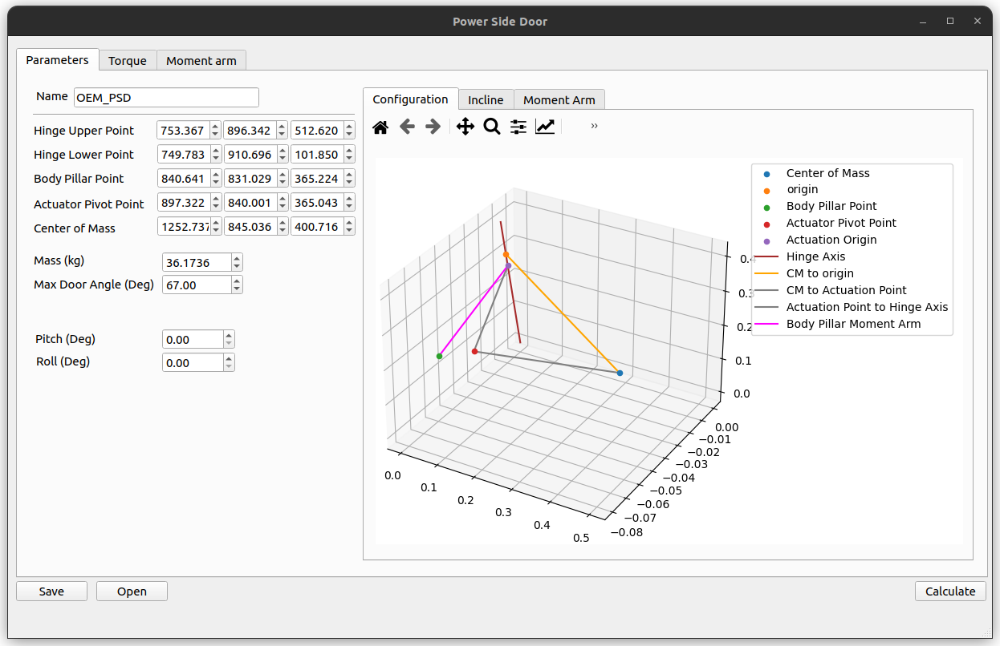
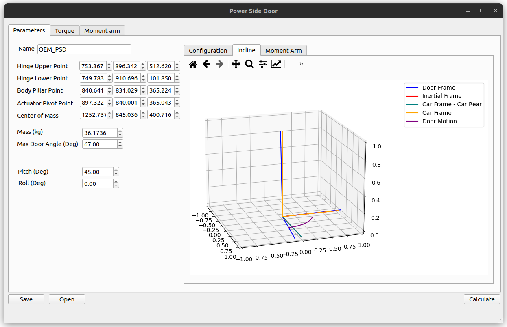
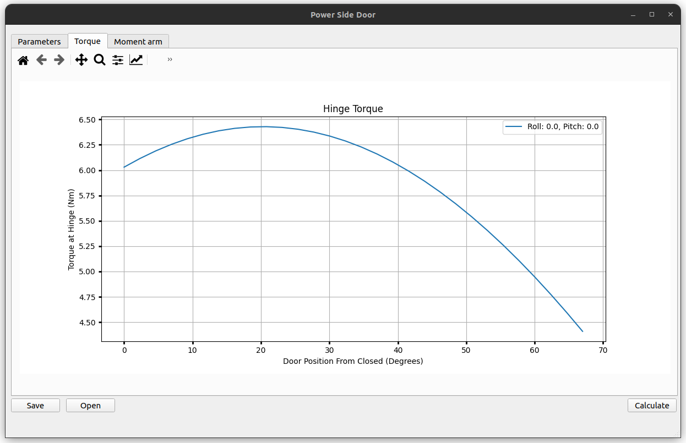
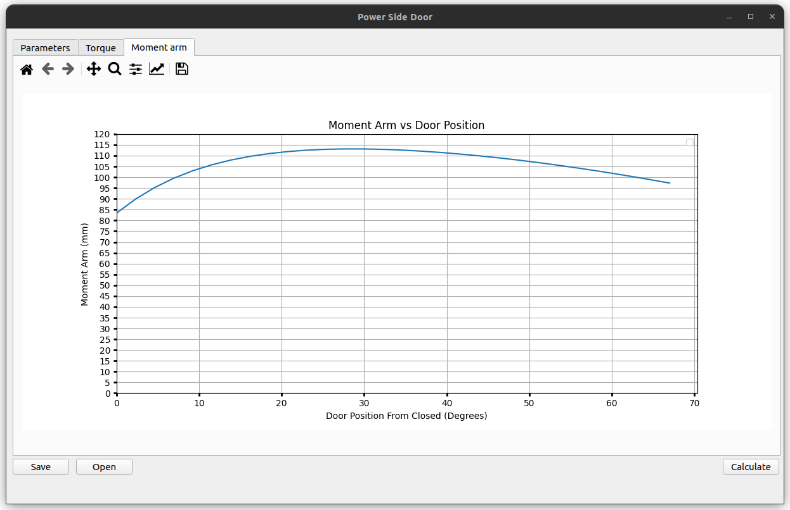

# Car Door Model

A model of a car door on a hinge under different incline and roll conditions. Reports the torque at the hinge along the path of the door as well as the moment arm of an actuator fixed on the door.

## Examples

